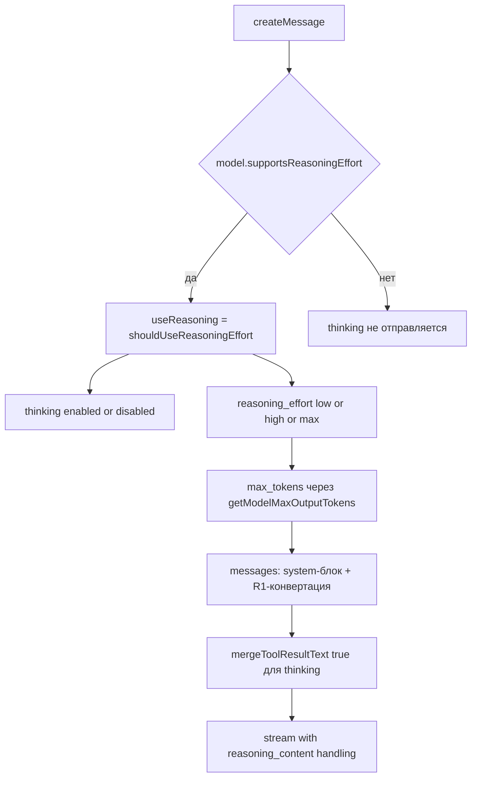

# План доработок для корректной работы с DeepSeek V4 Pro

## Цель

Привести провайдер DeepSeek в соответствие с актуальным API (поколение V4), чтобы запросы к `deepseek-v4-pro` работали без ошибок, корректно ограничивали длину ответа и сохраняли `reasoning_content` при цепочках инструментов.

## Текущее состояние

- [`deepseek.ts`](src/api/providers/deepseek.ts:25) наследует `OpenAiHandler`.
- Признак мышления определяется строкой [`isThinkingModel = modelId.includes("deepseek-reasoner")`](src/api/providers/deepseek.ts:53).
- Лимит токенов шлётся через наследуемый [`addMaxTokensIfNeeded`](src/api/providers/openai.ts:562), который пишет [`max_completion_tokens`](src/api/providers/openai.ts:572), а не `max_tokens`.
- Системный промпт оборачивается в user-сообщение в [`convertToR1Format`](src/api/transform/r1-format.ts:39).
- Модели описаны в [`packages/types/src/providers/deepseek.ts`](packages/types/src/providers/deepseek.ts:11); дефолт `deepseek-chat`.

## Эталонный паттерн

В проекте уже есть провайдер с точно такой же схемой thinking-toggle: [`zai.ts`](src/api/providers/zai.ts:25). Он использует:

- [`shouldUseReasoningEffort`](src/shared/api.ts:61) для определения, включено ли мышление.
- [`getModelMaxOutputTokens`](src/shared/api.ts:117) для лимита с параметром `max_tokens`.
- `thinking: useReasoning ? { type: "enabled" } : { type: "disabled" }`.
- Реальный `system`-блок и `mergeToolResultText: true` для thinking-моделей.

DeepSeek стоит привести к тому же виду, но с собственной мапой `reasoning_effort` (значения `low`/`high`/`max`).

## Диаграмма потока сборки запроса



## Шаг 1. Обновить метаданные моделей

Файл: [`packages/types/src/providers/deepseek.ts`](packages/types/src/providers/deepseek.ts:11).

### 1.1. Сменить дефолт

[`deepSeekDefaultModelId`](packages/types/src/providers/deepseek.ts:9) поменять с `"deepseek-chat"` на `"deepseek-v4-pro"`.

### 1.2. Дополнить `deepseek-v4-pro` и `deepseek-v4-flash`

Добавить в обе записи:

```ts
supportsReasoningEffort: true,
reasoningEffort: "high",
supportsTemperature: true,
defaultTemperature: 1,
```

Оставить `preserveReasoning: true` как есть. Это задействует уже существующий UI-селектор reasoning effort и путь сохранения `reasoning_content` в [`Task.ts`](src/core/task/Task.ts:5394).

### 1.3. Пометить legacy-модели устаревшими

В `deepseek-chat` и `deepseek-reasoner` добавить `deprecated: true`. Поле уже поддержано схемой [`modelInfoSchema`](packages/types/src/model.ts:125).

### 1.4. Обновить цены V4 Pro

Поля [`inputPrice`/`outputPrice`/`cacheReadsPrice`/`cacheWritesPrice`](packages/types/src/providers/deepseek.ts:47) привести к актуальному прайсу. Учесть, что тарифы теперь делятся на peak/off-peak (peak: cache hit $0.044, cache miss $1.32, output $3.96).

### 1.5. Опционально: vision-модель

Добавить запись `deepseek-v4-flash-vision-exp` с `supportsImages: true`. Это отдельная задача, для V4 Pro не требуется (V4 Pro текстовый).

## Шаг 2. Переписать тело `createMessage`

Файл: [`src/api/providers/deepseek.ts`](src/api/providers/deepseek.ts:44).

### 2.1. Расширить тип параметров

```ts
type DeepSeekChatCompletionParams = OpenAI.Chat.ChatCompletionCreateParamsStreaming & {
	thinking?: { type: "enabled" | "disabled" }
	reasoning_effort?: "low" | "high" | "max"
	max_tokens?: number
}
```

### 2.2. Заменить признак мышления

Убрать строковую проверку и использовать capability из `getModel()`:

```ts
const { info: modelInfo } = this.getModel()
const isThinkingModel = !!modelInfo.supportsReasoningEffort
const useReasoning = shouldUseReasoningEffort({ model: modelInfo, settings: this.options })
```

Импорт `shouldUseReasoningEffort` из [`../../shared/api`](src/shared/api.ts:61).

### 2.3. Лимит токенов через `max_tokens`

Убрать вызов `this.addMaxTokensIfNeeded(requestOptions, modelInfo)` ([`deepseek.ts`](src/api/providers/deepseek.ts:81)) и вместо него:

```ts
max_tokens: getModelMaxOutputTokens({ modelId, model: modelInfo, settings: this.options, format: "openai" }) ?? undefined,
```

Импорт `getModelMaxOutputTokens` из [`../../shared/api`](src/shared/api.ts:117). Это гарантирует, что в тело уходит `max_tokens`, а не `max_completion_tokens`.

### 2.4. Параметры мышления

В `requestOptions` добавить:

```ts
...(isThinkingModel && { thinking: useReasoning ? { type: "enabled" } : { type: "disabled" } }),
...(isThinkingModel && useReasoning && {
	reasoning_effort: mapDeepSeekReasoningEffort(this.options.reasoningEffort ?? modelInfo.reasoningEffort),
}),
```

### 2.5. Мапа reasoning_effort

Добавить приватную функцию в `DeepSeekHandler` (или локальную в модуле):

```ts
function mapDeepSeekReasoningEffort(effort?: string): "low" | "high" | "max" {
	if (effort === "low" || effort === "minimal") return "low"
	if (effort === "xhigh") return "max"
	return "high" // medium, high, none/undefined -> high
}
```

Сервер сам мапит `medium` и `xhigh` в `high`, поэтому клиентская мапа нужна только чтобы отдать `low` и `max` осмысленно.

### 2.6. Системная роль для V4

Сейчас [`deepseek.ts`](src/api/providers/deepseek.ts:61) всегда оборачивает системный промпт в user-сообщение. Для V4-моделей использовать настоящий `system`-блок:

```ts
const convertedMessages = isLegacyReasoner
	? convertToR1Format([{ role: "user", content: systemPrompt }, ...messages], { mergeToolResultText: true })
	: [
			{ role: "system", content: systemPrompt },
			...convertToR1Format(messages, { mergeToolResultText: isThinkingModel }),
		]
```

`isLegacyReasoner = modelId.includes("deepseek-reasoner")` сохранить только для legacy-пути. `mergeToolResultText` включить для всех thinking-моделей, включая V4.

### 2.7. Оставить без изменений

- Обработку `delta.reasoning_content` в [`deepseek.ts`](src/api/providers/deepseek.ts:112) менять не нужно, поле в стриме V4 осталось тем же.
- `stream_options: { include_usage: true }` остаётся.
- `processUsageMetrics` с кэш-полями `cached_tokens`/`cache_miss_tokens` остаётся.

## Шаг 3. Тесты

Файл: [`src/api/providers/__tests__/deepseek.spec.ts`](src/api/providers/__tests__/deepseek.spec.ts:1).

Добавить кейсы:

1. Для `deepseek-v4-pro` в теле запроса есть `max_tokens` и отсутствует `max_completion_tokens`.
2. Для `deepseek-v4-pro` при `reasoningEffort: "high"` отправляется `thinking: { type: "enabled" }` и `reasoning_effort: "high"`.
3. Для `deepseek-v4-pro` при `enableReasoningEffort === false` отправляется `thinking: { type: "disabled" }`.
4. Мапа усилия: `xhigh` превращается в `"max"`, `medium` в `"high"`, `low` в `"low"`.
5. Для `deepseek-v4-pro` системный промпт уходит как `system`-сообщение, а не как user-обёртка.
6. `mergeToolResultText: true` применяется для V4 Pro при tool-call (проверить, что текст после tool_result не создаёт user-сообщение).
7. Legacy `deepseek-reasoner` продолжает работать по старому пути (user-обёртка, thinking enabled).

## Шаг 4. Проверка типов, линт, сборка

Выполнить из корня:

```bash
pnpm check-types
pnpm lint
```

Тесты провайдера запускать из директории `src` (согласно правилам репозитория):

```bash
cd src && pnpm test api/providers/__tests__/deepseek.spec.ts
```

## Шаг 5. Changeset

Создать changeset для пакета `kilo-code` с `minor` (новая поддержка V4 Pro) или `patch` (фикс). Формат в [`.changeset`](AGENTS.md).

## Вне объёма (отдельные задачи)

- Полная поддержка vision-модели `deepseek-v4-flash-vision-exp` (ввод картинок, поле `detail`, лимиты размеров).
- Миграция `DeepSeekHandler` на `BaseOpenAiCompatibleProvider` по образцу [`zai.ts`](src/api/providers/zai.ts:25) как общая гигиена (не обязательна для фикса V4 Pro).
- Учёт peak/off-peak в подсчёте стоимости (сейчас цены хранятся одним числом).

## Порядок применения

Шаг 1 (метаданные) и Шаг 2 (обработчик) меняются вместе, чтобы не ломать типы. Шаг 3 (тесты) идёт сразу после, Шаг 4 и Шаг 5 завершают PR.
