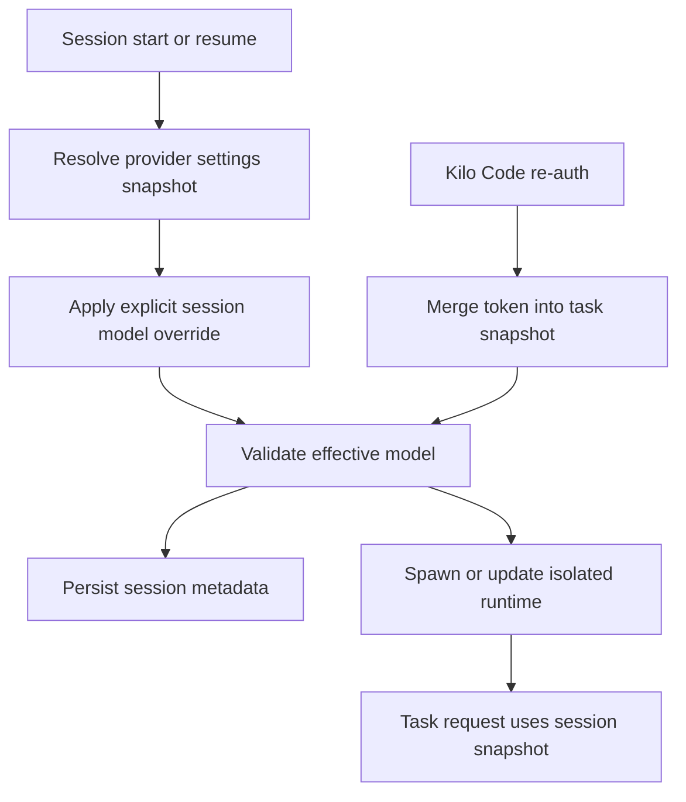

# Plan: Fix Per-Session Model Isolation

## Objective

Ensure that a Kilo Code session has one explicit effective model configuration at start or resume, that this configuration is isolated from other sessions, and that it remains authoritative after Kilo Code authentication refresh.

## Scope

This plan resolves the three reviewed defects:

1. Remote-only Agent Manager resume drops cloud `last_model` and falls back to the current sidebar model.
2. Agent Manager writes a selected model only to `kilocodeModel`, which does not apply to other providers.
3. Kilo Code authentication rebuilds the current task handler with a token-only configuration and drops session-local model settings.

No change is planned to intentionally change models of running sessions. Existing explicit profile or mode changes remain the only normal mutation paths.

## Target ownership model



### Invariant

For every active session, the following values must represent the same model:

- the model shown by Agent Manager or task UI;
- the model stored in session/history metadata;
- the provider-specific model field in that session's `ProviderSettings`;
- the result of `buildApiHandler(sessionConfig).getModel().id`;
- the model used for the next API request.

If the requested model cannot be applied, session creation or resume must fail visibly rather than silently use a default model.

## Implementation plan

### 1. Centralize provider-aware model overrides

**Files**

- [`packages/types/src/provider-settings.ts`](../packages/types/src/provider-settings.ts:779)
- New unit tests near [`packages/types/src/__tests__`](../packages/types/src/__tests__)

**Changes**

1. Add an exported immutable helper, for example `withModelId(settings, modelId)`.
2. Clone the incoming `ProviderSettings`; never mutate the caller's object.
3. Resolve the destination model field from [`modelIdKeysByProvider`](../packages/types/src/provider-settings.ts:793) when `apiProvider` is a typical provider.
4. For custom and faux providers, use `apiModelId`, matching the provider lookup behavior in [`getModelIdForProvider()`](../webview-ui/src/utils/validate.ts:258).
5. Treat `vscode-lm` as unsupported by Agent Manager unless an explicit selector-safe handling path is provided; fail rather than assigning an incompatible scalar field.
6. Re-read via [`getModelId()`](../packages/types/src/provider-settings.ts:779) and make the helper return an error/result union if no applicable field exists.

**Why this location**

The provider-to-model-field mapping already belongs to [`provider-settings.ts`](../packages/types/src/provider-settings.ts:793). Reusing it prevents a second drift-prone map in Agent Manager.

**Acceptance criteria**

- `kilocode` writes `kilocodeModel`.
- `openrouter` writes `openRouterModelId`.
- `requesty` writes `requestyModelId`.
- providers mapped to `apiModelId` write that field.
- original settings retain their original model after the helper returns.

### 2. Apply model overrides once while constructing Agent Manager config

**Files**

- [`src/core/kilocode/agent-manager/RuntimeProcessHandler.ts`](../src/core/kilocode/agent-manager/RuntimeProcessHandler.ts:215)
- [`src/core/kilocode/agent-manager/AgentManagerProvider.ts`](../src/core/kilocode/agent-manager/AgentManagerProvider.ts:780)

**Changes**

1. Replace direct mutation of `kilocodeModel` in [`RuntimeProcessHandler.buildAgentConfig()`](../src/core/kilocode/agent-manager/RuntimeProcessHandler.ts:247) with the helper from step 1.
2. Build an independent `providerSettings` object first, apply `options.model`, and assign only that copy into `AGENT_CONFIG`.
3. Build a handler from the prepared settings and compare `handler.getModel().id` against the requested model.
4. If the IDs differ, fail setup before `fork()` and report the requested provider, requested model, and resolved model. Do not create a misleading registry entry.
5. Pass the prepared effective configuration through the spawn options so the selected model and process configuration cannot diverge.
6. Record the effective model, rather than merely the UI-requested model, in [`AgentRegistry.createSession()`](../src/core/kilocode/agent-manager/AgentRegistry.ts:57).
7. Optionally extend the Agent Manager `ready` IPC payload from [`packages/agent-runtime/src/process.ts`](../packages/agent-runtime/src/process.ts:280) with the child handler's actual provider/model as a defense-in-depth assertion. The parent should turn a mismatch into a failed session.

**Design decision**

The parent owns deterministic configuration construction. The child confirmation is validation only, not a second configuration source.

### 3. Preserve cloud `last_model` during remote-only resume

**Files**

- [`src/core/kilocode/agent-manager/RemoteSessionService.ts`](../src/core/kilocode/agent-manager/RemoteSessionService.ts:11)
- [`src/core/kilocode/agent-manager/RuntimeProcessHandler.ts`](../src/core/kilocode/agent-manager/RuntimeProcessHandler.ts:57)
- [`src/core/kilocode/agent-manager/AgentManagerProvider.ts`](../src/core/kilocode/agent-manager/AgentManagerProvider.ts:1400)
- [`packages/agent-runtime/src/process.ts`](../packages/agent-runtime/src/process.ts:93)
- [`packages/agent-runtime/src/host/ExtensionHost.ts`](../packages/agent-runtime/src/host/ExtensionHost.ts:219)

**Changes**

1. Add `model: string | null` to all local `SessionMetadata` and resume DTOs.
2. Include `last_model` in the narrowed cloud response type in [`RemoteSessionService.fetchSessionDataForResume()`](../src/core/kilocode/agent-manager/RemoteSessionService.ts:96).
3. Copy `last_model` into returned resume metadata.
4. Resolve the model in this strict order in [`AgentManagerProvider.resumeSession()`](../src/core/kilocode/agent-manager/AgentManagerProvider.ts:1455):
    1. server-side `sessionData.metadata.model`;
    2. local `session.model` for legacy/local sessions;
    3. no override only when neither exists.
5. Pass that resolved model to the same configuration preparation path from step 2.
6. Preserve the selected effective model in the resumed registry record.
7. Update all AgentConfig/resume type definitions so TypeScript enforces complete propagation.

**Behavior for legacy cloud sessions**

If the backend returns no `last_model`, retain current behavior but mark the session as legacy in logs; do not fabricate a model value. This is backward-compatible and distinguishes unavailable historic data from a new bug.

### 4. Make re-auth update the full session configuration

**Files**

- [`src/core/webview/ClineProvider.ts`](../src/core/webview/ClineProvider.ts:2241)
- [`src/core/webview/__tests__/ClineProvider.kilocode-organization.spec.ts`](../src/core/webview/__tests__/ClineProvider.kilocode-organization.spec.ts:1)
- New focused callback test file if existing fixture setup is unsuitable

**Changes**

1. Keep profile persistence through [`ClineProvider.upsertProviderProfile()`](../src/core/webview/ClineProvider.ts:1958).
2. Remove direct assignment of a token-only handler in [`ClineProvider.handleKiloCodeCallback()`](../src/core/webview/ClineProvider.ts:2253).
3. For the current task, obtain the exact current session configuration using [`Task.getSessionApiConfiguration()`](../src/core/task/Task.ts:861).
4. Merge only the callback-owned authentication fields into that snapshot:
    - set `apiProvider` to `kilocode` when the callback changes provider;
    - set `kilocodeToken` to the new token;
    - preserve `kilocodeModel`, organization, reasoning, tool protocol, and all task-local settings.
5. Commit through [`Task.updateApiConfiguration()`](../src/core/task/Task.ts:2006), or preferably a small ClineProvider helper that also maintains runtime profile and persists the current task binding consistently.
6. Assert after update that task configuration, `task.api.getModel().id`, and [`Task.getSessionRuntimeConfig()`](../src/core/task/Task.ts:850) identify the same model.

**Failure handling**

If a callback changes a task from a non-Kilo Code provider but the existing model is invalid for Kilo Code, use Kilo Code's configured/default model deliberately and update all three representations together. Do not retain a profile name or UI label implying the old model is still active.

### 5. Add regression coverage

**Files**

- New tests for [`RuntimeProcessHandler`](../src/core/kilocode/agent-manager/RuntimeProcessHandler.ts:122)
- [`src/core/kilocode/agent-manager/__tests__/AgentManagerProvider.spec.ts`](../src/core/kilocode/agent-manager/__tests__/AgentManagerProvider.spec.ts:32)
- New or extended tests for [`RemoteSessionService`](../src/core/kilocode/agent-manager/RemoteSessionService.ts:38)
- [`src/core/webview/__tests__/ClineProvider.kilocode-organization.spec.ts`](../src/core/webview/__tests__/ClineProvider.kilocode-organization.spec.ts:1)
- New unit tests for the settings helper from step 1

**Required cases**

1. **Parallel launch isolation:** construct two spawn configs from one baseline, override with model A and model B, and prove their serialized `AGENT_CONFIG` values are independent.
2. **Provider mapping:** assert Kilo Code, OpenRouter, Requesty, and an `apiModelId` provider write the correct field and preserve all unrelated settings.
3. **No silent fallback:** mock a handler that resolves model C from requested model A; creation fails before `fork()`.
4. **Local resume:** local session model A resumes while primary window default is B; child config uses A.
5. **Remote-only resume:** fetched cloud session has `last_model = A`, no local registry record exists, primary window default is B; child config uses A.
6. **Legacy remote resume:** no `last_model`; behavior is documented and no false assertion claims a recovered model.
7. **Kilo Code callback:** task starts with model A and non-default session fields; after re-auth, handler model and session runtime still use A.
8. **Sidebar concurrency regression:** retain/extend [`Task.sticky-profile-race.spec.ts`](../src/core/task/__tests__/Task.sticky-profile-race.spec.ts:203) to protect separate task bindings.

### 6. Validate and document the invariant

**Commands**

Run tests from the package that declares Vitest:

```bash
cd src && pnpm test \
  core/kilocode/agent-manager/__tests__/AgentManagerProvider.spec.ts \
  core/kilocode/agent-manager/__tests__/RuntimeProcessHandler.spec.ts \
  core/kilocode/agent-manager/__tests__/RemoteSessionService.spec.ts \
  core/webview/__tests__/ClineProvider.kilocode-organization.spec.ts \
  core/task/__tests__/Task.sticky-profile-race.spec.ts
```

Then run type checks for each affected package:

```bash
pnpm --filter @roo-code/types check-types
pnpm --filter @kilocode/agent-runtime check-types
cd src && pnpm check-types
```

Update [`docs/per-session-model-isolation-review.md`](../docs/per-session-model-isolation-review.md:1) with post-fix evidence, particularly the legacy-session fallback policy and the model mismatch rejection behavior.

## Risks and mitigations

| Risk                                                            | Mitigation                                                                                                                                                                |
| --------------------------------------------------------------- | ------------------------------------------------------------------------------------------------------------------------------------------------------------------------- |
| Provider mapping is incomplete as providers are added           | Centralize override on `modelIdKeysByProvider`; add exhaustive tests and fail unsupported providers                                                                       |
| Cloud sessions created before `last_model` existed              | Treat it as absent legacy metadata, log it, preserve compatible fallback behavior                                                                                         |
| Requested model has provider-side alias or prefix normalization | Validate with handler output using documented canonicalization before comparing; if no canonicalizer exists, reject only clear mismatches and add provider-specific cases |
| Re-auth changes provider semantics                              | Update the complete task snapshot through one mutation method and verify persisted runtime + handler after mutation                                                       |
| UI shows requested model before runtime confirms it             | Store and render the confirmed effective model after child ready; show startup error on mismatch                                                                          |

## Completion criteria

The fix is complete when all of the following hold:

1. A remote-only resumed session uses cloud `last_model` even when the currently selected sidebar model differs.
2. A model selected for an Agent Manager session writes to the correct provider-specific field for all supported providers.
3. Invalid or unapplicable model selection fails clearly without default-model substitution.
4. Kilo Code re-auth preserves the current task's model and full session configuration.
5. The regression suite proves two concurrently configured sessions use different effective models.
6. UI/session metadata and actual handler model are verified equal at start and resume.
