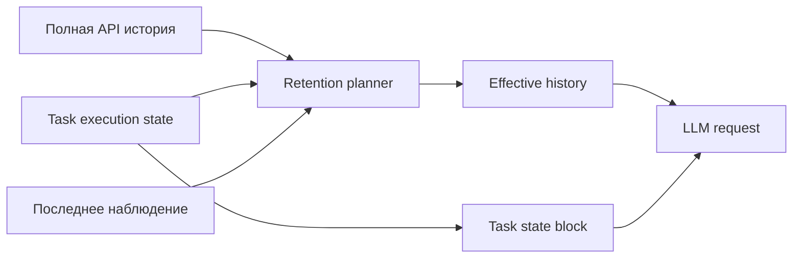

# Пошаговый план интеграции У1–У3 в Kilo Code

## 1. Цель и границы

Цель — сократить кумулятивный расход контекста на длинных задачах, сохранив или улучшив качество решений, за счёт гибридной архитектуры:

- **У1:** явное структурированное состояние задачи `TaskExecutionState`;
- **У2:** проекция существенных результатов инструментов в это состояние и безопасное вытеснение устаревших сырых наблюдений;
- **У3:** структурированный результат condense вместо одного свободного текста.

Интеграция выполняется поэтапно, под выключенным по умолчанию feature flag, без изменения поведения существующих сессий и без немедленного отказа от полной истории.

### Не входит в MVP

- полное удаление истории после каждого шага;
- изменение внешних API провайдеров;
- автоматическое LLM-обновление состояния после каждого tool result;
- обязательный UI-редактор состояния;
- изменение семантики checkpoints/rewind;
- агрессивное вытеснение незаменённых raw tool results.

## 2. Архитектурное решение

### ADR-001: Гибридное состояние поверх недеструктивной истории

**Статус:** Proposed.

**Контекст:** текущая история нужна для UI, аудита, rewind и совместимости с native tool pairs. Полная модель SKILL.state неприменима напрямую.

**Решение:** хранить полную историю как сейчас, но перед API-запросом строить отдельное effective-представление:



Старые сообщения скрываются только если необходимые факты уже закреплены в валидированном состоянии или structured condense. Storage остаётся недеструктивным.

### Альтернативы

1. **Полная замена истории состоянием:** максимальная экономия, но неприемлемый риск потери объяснимости, rewind и provider compatibility.
2. **Только улучшить summary:** проще, но статья показывает, что свободный summary существенно уступает структурированному состоянию.
3. **LLM-компрессия каждого tool result:** дорого, повышает latency и создаёт дополнительную точку отказа.

### Последствия

- положительное: обратимость, A/B-сравнение, постепенное включение;
- отрицательное: временно существуют два представления состояния — полная история и структурный state;
- операционное: потребуются версии схемы, миграция и наблюдаемость расхождений.

## 3. Целевая модель данных У1

### 3.1. Добавить версионированные типы

Создать [`task-execution-state.ts`](packages/types/src/task-execution-state.ts) и экспортировать его из [`index.ts`](packages/types/src/index.ts:1).

Предлагаемая минимальная схема:

```typescript
type TaskExecutionStateV1 = {
	version: 1
	revision: number
	goal: {
		original: string
		current?: string
	}
	progress: {
		phase?: string
		todos: TodoItem[]
	}
	files: Record<
		string,
		{
			status: "discovered" | "read" | "modified" | "created" | "deleted"
			lastObservedAt: number
			contentHash?: string
			relevantSymbols?: string[]
			summary?: string
		}
	>
	decisions: Array<{
		id: string
		statement: string
		rationale?: string
		status: "active" | "superseded"
	}>
	hypotheses: Array<{
		id: string
		statement: string
		status: "active" | "confirmed" | "rejected"
		evidenceRefs?: string[]
	}>
	constraints: string[]
	pendingQuestions: string[]
	observations: Array<{
		id: string
		kind: string
		summary: string
		sourceRef: string
		observedAt: number
		retention: "ephemeral" | "until-superseded" | "durable"
	}>
	provenance: {
		lastUpdatedAt: number
		source: "runtime" | "tool" | "condense" | "user"
	}
}
```

### 3.2. Ограничить размер схемы

Задать детерминированные лимиты:

- `goal.original` — исходный текст без вложенного содержимого mentions;
- не более 100 file entries, затем LRU-вытеснение только `discovered/read` без pending relevance;
- не более 20 active decisions и 20 hypotheses;
- `summary` файла — ограниченный текст, без полного содержимого;
- `observations` — кольцевой буфер, например 30 записей;
- общий сериализованный state — soft budget 4k токенов, hard budget 8k.

При превышении soft budget сначала удаляются `ephemeral`, затем устаревшие `superseded/rejected`, затем сокращаются summary. `goal`, активные constraints, pending todos и modified files не удаляются автоматически.

### 3.3. Добавить слой управления состоянием

Создать [`TaskStateManager.ts`](src/core/task-state/TaskStateManager.ts) с обязанностями:

1. `initialize(taskText, todos)`;
2. `load(savedState)` с zod-валидацией и миграцией;
3. `applyPatch(patch, expectedRevision)`;
4. dictionary merge с явным списком полей, допускающих удаление;
5. `projectObservation(observation)`;
6. `renderForPrompt(tokenBudget)`;
7. `compactToBudget(tokenBudget)`;
8. `snapshot()` для persistence;
9. `restore(snapshot)` для rewind/checkpoint.

Запретить произвольный deep merge: каждый тип коллекции получает собственную семантику upsert/delete. `revision` предотвращает потерю обновлений при параллельных tools/subtasks.

## 4. Feature flags и режимы запуска

### 4.1. Добавить независимые flags

Расширить [`EXPERIMENT_IDS`](src/shared/experiments.ts:3) и соответствующую схему [`experiment.ts`](packages/types/src/experiment.ts):

- `taskExecutionState` — У1, только сбор и отображение state;
- `toolObservationProjection` — У2, зависит от У1;
- `structuredCondense` — У3, зависит от У1;
- `compactEffectiveHistory` — фактическое вытеснение raw observations; отдельный kill switch, выключен на первых этапах.

Все defaults — `false`. Если зависимость отключена, дочерний flag считается неактивным.

### 4.2. Зафиксировать variant на уровне задачи

Не читать flags заново на каждом ходе. При создании задачи сохранить variant в task/session runtime snapshot, чтобы один диалог не менял семантику посередине. Существующие history items без поля получают legacy variant.

## 5. Persistence и обратная совместимость

### 5.1. Выбрать отдельный state-файл

Рекомендуется отдельный [`task_execution_state.json`](src/core/task-persistence/taskExecutionState.ts), а не расширение каждого API-message:

- state не дублируется по истории;
- не ломается сериализация Anthropic message types;
- можно независимо версионировать;
- проще откатить feature flag.

Добавить имя в [`globalFileNames.ts`](src/shared/globalFileNames.ts).

### 5.2. Жизненный цикл

1. Новая flagged task: state создаётся из исходной задачи и todos.
2. Каждый валидный patch атомарно сохраняется через safe JSON write.
3. Resume flagged task: загрузить state; при отсутствии создать conservative state из исходной задачи и текущих todos, но **не** реконструировать решения из истории автоматически в MVP.
4. Legacy task: state не создаётся, пока пользователь явно не включит миграцию новой сессии.
5. Повреждённый state: quarantine файла, telemetry, fallback на legacy history без остановки задачи.

### 5.3. Checkpoint/rewind

State обязан следовать rewind. Минимальный безопасный вариант:

- сохранять snapshot state в служебном событии/файле при каждом checkpoint;
- при [`rewindToTimestamp()`](src/core/message-manager/index.ts:128) восстанавливать последний snapshot не позже cutoff;
- если snapshot отсутствует — сбрасывать state и отключать `compactEffectiveHistory` для этой задачи.

До реализации этого пункта У1 может работать read-only для prompt, но У2-вытеснение включать нельзя.

## 6. У1: интеграция task state в runtime

### Шаг У1.1. Инициализация

В [`Task`](src/core/task/Task.ts:203):

- добавить `taskStateManager?: TaskStateManager`;
- создавать его в constructor только при effective flag;
- в [`startTask()`](src/core/task/Task.ts:2313) инициализировать исходной задачей и `todoList`;
- в [`resumeTaskFromHistory()`](src/core/task/Task.ts:2361) загружать сохранённый state.

### Шаг У1.2. Синхронизация todos

После успешного [`setTodoListForTask()`](src/core/tools/UpdateTodoListTool.ts:82) обновлять `progress.todos` тем же валидированным массивом. Todo остаётся источником истины для UI; TaskStateManager получает копию.

### Шаг У1.3. Рендер в prompt

В [`getEnvironmentDetails()`](src/core/environment/getEnvironmentDetails.ts:57) добавить компактный блок:

```text
<task_execution_state version="1" revision="12">
{minified JSON}
</task_execution_state>
```

Порядок: после Current Mode, перед динамическим terminal/browser контекстом. State не должен включаться в system prompt: он меняется каждый ход и не должен инвалидировать provider prompt cache постоянной части.

### Шаг У1.4. Управляемое обновление моделью

Для MVP не заставлять каждый ответ содержать JSON patch. Добавить always-available tool [`update_task_state`](src/core/tools/UpdateTaskStateTool.ts), который:

- принимает ограниченный discriminated-union patch;
- не позволяет модели менять `goal.original`, `version`, `revision` и provenance;
- валидирует размеры, пути и ссылки evidence;
- применяет optimistic revision;
- возвращает краткий результат без полного повторения state.

В tool description предписать вызывать инструмент только при появлении факта, влияющего на будущие действия. Не требовать вызова после каждого шага: это снизит количество лишних turns.

### Шаг У1.5. Fail-safe

Ошибка state update не должна помечать основную операцию как неуспешную и не должна блокировать completion. Модель получает короткий tool error и может продолжать по legacy history.

## 7. У2: проекция результатов инструментов

### Шаг У2.1. Ввести нормализованное наблюдение

Создать [`ToolObservation.ts`](src/core/task-state/ToolObservation.ts):

```typescript
type ToolObservation = {
	observationId: string
	toolName: ToolName | string
	toolUseId?: string
	status: "success" | "error" | "denied" | "partial"
	paths: string[]
	command?: string
	contentHash: string
	rawTokenEstimate: number
	occurredAt: number
	payload: ToolResponse
}
```

### Шаг У2.2. Перехватить результат в единой точке

Не менять каждый handler. Обернуть callback `pushToolResult` в [`presentAssistantMessage()`](src/core/assistant-message/presentAssistantMessage.ts:619), где уже сходятся native и XML результаты:

1. сохранить raw result как сейчас;
2. асинхронно передать tool name, args и result в projector;
3. projector обновляет state;
4. ошибка projector логируется, но raw result остаётся неизменным.

Для tools, которые обходят BaseTool, эта точка всё равно предпочтительнее [`BaseTool.handle()`](src/core/tools/BaseTool.ts:177), так как общий callback применяется и к legacy handlers.

### Шаг У2.3. Реализовать детерминированные projectors

MVP без LLM-вызова:

- `read_file`: путь, диапазоны, hash результата, `status=read`; summary не генерировать;
- `write_to_file`/`apply_diff`/`edit_file`/`delete_file`: путь и конечный статус;
- `search_files`/`codebase_search`: запрос, число результатов, top paths;
- `execute_command`: команда, cwd, exit/active status, последние диагностические строки в ограниченном размере;
- diagnostics: количество ошибок/предупреждений и paths;
- MCP/browser: только метаданные, raw не вытеснять в MVP.

Projector не должен интерпретировать смысл кода; он извлекает только структурно надёжные факты.

### Шаг У2.4. Ввести retention metadata

Расширить внутренний [`ApiMessage`](src/core/task-persistence/apiMessages.ts:12) опциональными полями:

- `observationId`;
- `retentionClass`;
- `projectedStateRevision`;
- `rawContentHash`;
- `supersededByObservationId`.

Поля используются только локально и должны удаляться provider converter либо игнорироваться при построении `MessageParam`.

Классы:

- `protocol-critical`: tool_use/result пары, последнее наблюдение — никогда не скрывать;
- `durable-evidence`: ошибки и пользовательский feedback — скрывать только после structured condense;
- `replaceable`: старые file reads/search outputs — можно скрыть после доказанной проекции;
- `ephemeral`: прогресс, повторная телеметрия — скрывать при следующем подтверждённом наблюдении.

### Шаг У2.5. Shadow mode

До фактического вытеснения planner только рассчитывает:

- какие блоки мог бы скрыть;
- сколько токенов было бы сэкономлено;
- какие state fields служат заменой;
- остаются ли валидными native tool pairs.

В API всё ещё идёт legacy history. Shadow-метрики позволяют проверить полноту projectors без риска для пользователя.

### Шаг У2.6. Безопасное включение compact history

После прохождения gates включить [`compactEffectiveHistory`](src/shared/experiments.ts:3):

1. всегда сохранить исходную задачу;
2. всегда сохранить последние 3 сообщения как сейчас;
3. никогда не разделять native tool_use/tool_result;
4. скрывать только сообщения с `projectedStateRevision <= current revision` и совпадающим content hash;
5. не скрывать пользовательские сообщения, feedback, ошибки или сообщения с images в MVP;
6. вставлять компактный marker с observation IDs;
7. хранить полную историю недеструктивно для rewind.

## 8. У3: structured condense

### Шаг У3.1. Версионированный контракт ответа

Создать [`StructuredCondenseResult`](packages/types/src/context-management.ts), например:

```typescript
type StructuredCondenseResultV1 = {
	version: 1
	state_patch: TaskExecutionStatePatchV1
	narrative_summary: string
	evidence_refs: string[]
	unresolved: string[]
}
```

`state_patch` не содержит полного state: это минимальный patch. `evidence_refs` ссылаются на message IDs/observation IDs и позволяют проверить происхождение.

### Шаг У3.2. Новый prompt condense

Создать отдельный [`STRUCTURED_SUMMARY_PROMPT`](src/core/condense/structuredPrompt.ts), который требует:

- не удалять существующие активные constraints без явного доказательства;
- не считать tool attempt успешным без success observation;
- переносить точные пути, symbols, diagnostics и пользовательские решения;
- не включать секреты или полное содержимое файлов в state;
- отдавать только JSON по schema/structured output, если provider поддерживает;
- разделять durable state и narrative context.

### Шаг У3.3. Provider strategy

Приоритет:

1. native structured output / JSON schema, если handler поддерживает;
2. fenced JSON + строгий parser;
3. при parse/validation failure — один repair attempt;
4. затем fallback на текущий [`SUMMARY_PROMPT`](src/core/condense/index.ts:164);
5. если fallback также неуспешен — существующий sliding-window flow без изменений.

Не изменять специальные правила thinking/tool pairing в [`summarizeConversation()`](src/core/condense/index.ts:408).

### Шаг У3.4. Двухфазное применение

Structured condense применяется транзакционно:

1. получить и распарсить ответ;
2. валидировать state patch;
3. проверить token reduction;
4. применить patch к копии state;
5. построить candidate effective history;
6. проверить native tool pairs и provider invariants;
7. атомарно сохранить state и новую history metadata;
8. при любой ошибке не менять ни state, ни history.

### Шаг У3.5. Представление summary в истории

Оставить assistant summary message для совместимости, но текст сделать компактным:

- narrative summary;
- hash/revision structured state;
- список unresolved;
- сохранённые thinking/tool_use blocks по текущей логике.

Полный JSON state не дублировать в summary message: он уже добавляется отдельным `task_execution_state` на каждом ходе.

## 9. Совместимость и отказоустойчивость

### 9.1. Native tools

- перед скрытием message запускать существующую проверку tool ID;
- сохранять связанные reasoning/thinking blocks;
- tool result текущего хода никогда не заменять state до следующего успешного API-turn;
- при сомнении классифицировать как `protocol-critical`.

### 9.2. XML protocol

- сохранять подписи tools и результаты последнего хода;
- projection metadata не должна попадать в пользовательский XML-текст;
- parse mentions выполняется до projection, как сейчас.

### 9.3. Model/profile switch

- state независим от provider;
- summary message остаётся provider-compatible;
- при extended-thinking incompatibility используется текущий uncondense/recondense flow;
- если structured condense handler отличается от main handler, main handler должен валидировать итоговую историю до сохранения.

### 9.4. Subtasks

В MVP state изолирован по taskId. Child получает:

- исходное сообщение делегирования;
- read-only snapshot релевантной части parent state;
- собственный state.

По завершении child возвращает structured completion patch; parent применяет его только после проверки `completedByChildId`. Прямой shared mutable state отложить из-за конфликтов конкурентной записи.

### 9.5. Privacy и security

- не помещать raw secrets в state;
- state persistence подчиняется тем же storage/privacy правилам, что task history;
- paths нормализовать относительно workspace;
- projector не читает файлы дополнительно;
- telemetry содержит только counts, token sizes, categories и booleans, без содержимого state/tool results.

## 10. Тестовая стратегия

### 10.1. Unit tests

Добавить тесты:

- schema parsing и миграция state;
- patch merge, null deletion, revision conflict;
- compaction priority и hard budget;
- todo synchronization;
- рендер deterministic/minified state;
- projector для каждого MVP tool class;
- retention classification;
- structured condense parser и repair/fallback;
- transactional rollback;
- native tool pair preservation;
- corrupted/missing state fallback.

Основные каталоги: [`packages/types/src/__tests__`](packages/types/src/__tests__), [`src/core/task-state/__tests__`](src/core/task-state/__tests__), [`src/core/condense/__tests__`](src/core/condense/__tests__).

### 10.2. Интеграционные тесты

Сценарии:

1. 20 последовательных read/search/edit ходов: state стабилен, shadow savings растёт;
2. повторное чтение изменённого файла: старое наблюдение superseded;
3. внешний drift файла: новый hash обновляет state и предотвращает доверие старому read;
4. condense на границе native tool pair;
5. resume flagged task;
6. rewind до condense/projected observation;
7. profile switch на Anthropic extended thinking;
8. child task completion;
9. disable flag посередине: fallback на полную history без потери данных.

### 10.3. Evals качества

Использовать [`packages/evals`](packages/evals) для A/B:

- одинаковые задачи и модели;
- контрольная группа legacy;
- treatment У1, У1+У2 shadow, У1+У2 compact, У1+У2+У3;
- минимум три категории: multi-file edit, debugging с terminal noise, long refactor с повторными reads.

Метрики:

- task success и тесты проекта — primary gate;
- cumulative input tokens;
- median/p95 prompt tokens;
- число condense;
- число повторных одинаковых tool calls;
- число повторных чтений без изменения hash;
- state validation failure rate;
- structured condense fallback rate;
- rewind/resume correctness;
- wall-clock latency и condense cost.

## 11. Release gates

### Gate A — У1 shadow/read-only

- state schema/persistence покрыты тестами;
- legacy prompt идентичен при flag off;
- state block ≤4k токенов p95;
- resume/rewind не теряют state;
- нет утечки содержимого в telemetry.

### Gate B — У2 shadow

- ≥95% успешных tool results получают валидный observation record;
- 0 нарушений tool_use/tool_result pairs;
- ≥25% потенциальной экономии на long-edit eval;
- state расхождения исследованы до compact mode.

### Gate C — У2 compact для внутренней когорты

- task success не ниже legacy более чем на согласованный статистический допуск;
- cumulative input tokens уменьшаются ≥20%;
- fallback на full history работает без потери task;
- 0 критических resume/rewind regressions.

### Gate D — У3

- structured parse success ≥98% на поддерживаемых моделях;
- fallback rate <5%;
- качество не хуже legacy summary;
- cumulative tokens дополнительно уменьшаются либо подтверждено снижение повторных ходов.

## 12. Этапы поставки

### Фаза 0. Instrumentation baseline

1. Добавить локальный расчёт состава prompt по категориям: system/history/tool results/environment/state.
2. Записать baseline evals и сохранить fixtures.
3. Добавить regression tests для существующего condense и truncation.
4. Проверить/исправить вызов [`handleContextWindowExceededError()`](src/core/task/Task.ts:4553), чтобы overflow recovery не смешивал результаты эксперимента.

### Фаза 1. У1 read-only state

1. Типы и schema.
2. TaskStateManager.
3. Persistence и migration fallback.
4. Инициализация в Task.
5. Синхронизация todos/files от детерминированных runtime events.
6. Рендер state в environment details.
7. Unit/integration tests.
8. Gate A.

### Фаза 2. У1 model updates

1. Tool `update_task_state`.
2. Ограниченный patch contract.
3. Prompt guidance.
4. Revision conflicts и rollback.
5. Evals повторных действий.

### Фаза 3. У2 shadow projection

1. ToolObservation.
2. Централизованный interception.
3. Deterministic projectors.
4. Retention metadata.
5. Shadow retention planner.
6. Метрики потенциальной экономии.
7. Gate B.

### Фаза 4. У2 compact effective history

1. Недеструктивное скрытие replaceable observations.
2. Pair/provider validation.
3. Rewind/state snapshots.
4. Kill switch и fallback на full history.
5. Gate C.

### Фаза 5. У3 structured condense

1. Контракт результата.
2. Structured prompt и parser.
3. Provider strategy и repair.
4. Двухфазная транзакция state+history.
5. Совместимость thinking/tool pairs.
6. Evals и Gate D.

### Фаза 6. Постепенный rollout

1. Только локальные разработчики.
2. Внутренняя opt-in когорта.
3. Малый процент новых сессий на поддерживаемых моделях.
4. Расширение по данным quality/token metrics.
5. Старые сессии остаются legacy; миграция включается отдельно.

## 13. Обязательные правила реализации в этом репозитории

- Все новые core-файлы пометить `kilocode_change - new file`; изменения общих файлов обрамлять `kilocode_change` markers согласно [`AGENTS.md`](AGENTS.md).
- Не отключать lint rules.
- Добавить changeset, так как изменение пользовательское и функциональное.
- Тесты запускать из workspace, где объявлен vitest, согласно [`AGENTS.md`](AGENTS.md).
- Сначала реализовать и проверить flag-off path: он должен быть функционально и байтово максимально близок к текущему поведению.

## 14. Критерий завершения интеграции

У1–У3 считаются интегрированными, когда новая сессия под treatment flag:

1. имеет валидное, ограниченное по размеру task state;
2. проецирует детерминированные tool observations и безопасно скрывает только заменённые raw outputs;
3. выполняет structured condense транзакционно;
4. корректно resume/rewind/switch-provider;
5. при выключении flag продолжает работу по полной legacy history;
6. проходит quality gates и показывает измеримое снижение кумулятивных input tokens.

## 15. Приблизительный бюджет реализации в токенах GPT-5.6 Terra

Это оценка объёма работы модели, а не гарантированный счёт API. Она предполагает, что реализация ведётся по этому плану, задачи выполняются отдельными итерациями, а после каждой крупной фазы контекст сжимается. В оценку включены чтение релевантного кода, проектирование, изменения, тесты и исправление типичных ошибок.

| Блок                                                         | Оценка токенов модели | Что входит                                                                             |
| ------------------------------------------------------------ | --------------------: | -------------------------------------------------------------------------------------- |
| Фаза 0: baseline и instrumentation                           |                 8–15k | уточнение существующих путей, счётчики prompt categories, baseline-тесты               |
| У1: типы, `TaskStateManager`, persistence, render, todo sync |                30–50k | schema, state lifecycle, state block, migration/fallback, unit tests                   |
| У1: `update_task_state` и revision safety                    |                15–25k | tool contract, validation, merge/delete semantics, rollback tests                      |
| У2: `ToolObservation` и deterministic projectors             |                25–45k | interception, классификация результатов, file/command/search/edit projectors           |
| У2: shadow planner и compact effective history               |                25–45k | retention metadata, token simulation, non-destructive hiding, native-pair checks       |
| У3: structured condense                                      |                35–60k | schema, prompt, parser, repair, provider fallback, transaction, thinking compatibility |
| Интеграционные тесты и evals                                 |                25–45k | resume, rewind, subtasks, provider switch, long-horizon scenarios, metrics             |
| Отладка и стабилизация                                       |                20–40k | type errors, provider-specific regressions, test fixes, edge cases                     |
| Документация, changeset и rollout                            |                 5–10k | feature flag docs, operational notes, release gate record                              |
| **Итого для полного MVP У1–У3**                              |          **188–335k** | при сохранении legacy fallback и feature flags                                         |

### Практический диапазон

- **Оптимистичный:** 150–190k токенов — если существующие типы и тестовые mocks легко расширяются, а structured output поддерживается выбранными провайдерами.
- **Реалистичный:** **220–280k токенов** — рекомендуемый бюджет для планирования реализации полного MVP.
- **С запасом:** 300–400k токенов — если придётся дорабатывать provider adapters, native thinking compatibility, rewind/checkpoint semantics и eval fixtures.

### Что может увеличить бюджет

1. Поддержка большого числа провайдеров с разными structured-output и tool-call ограничениями.
2. Требование мигрировать уже сохранённые старые сессии, а не только новые flagged sessions.
3. Полная синхронизация state с checkpoints, rewind и child tasks.
4. Включение UI для просмотра, редактирования и восстановления state.
5. Автоматическая LLM-проекция каждого tool result вместо детерминированных MVP-projectors.
6. Необходимость доказать статистически значимое отсутствие деградации качества на большом eval-наборе.

### Как удержать расход ближе к нижней границе

- сначала реализовать У1 read-only и shadow У2;
- не менять все tool handlers по отдельности, а перехватить общий `pushToolResult`;
- не добавлять UI в первый релиз;
- не реконструировать state из старой истории автоматически;
- не включать compact history до завершения shadow-метрик;
- выполнять У3 после стабилизации У1 и У2;
- на каждую фазу выделять отдельный implementation task и после него делать condense.

Оценка не включает стоимость самих condensing-вызовов во время работы приложения и не является оценкой денежных затрат: фактическая цена зависит от тарифов, кэширования, размера файлов и количества повторных запросов.
